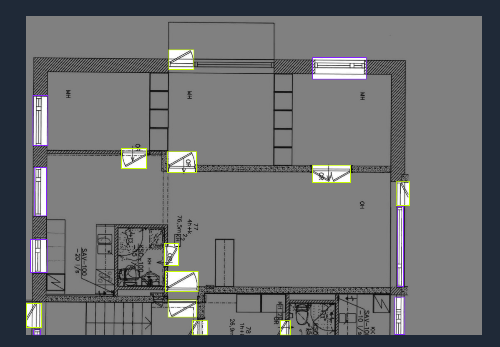
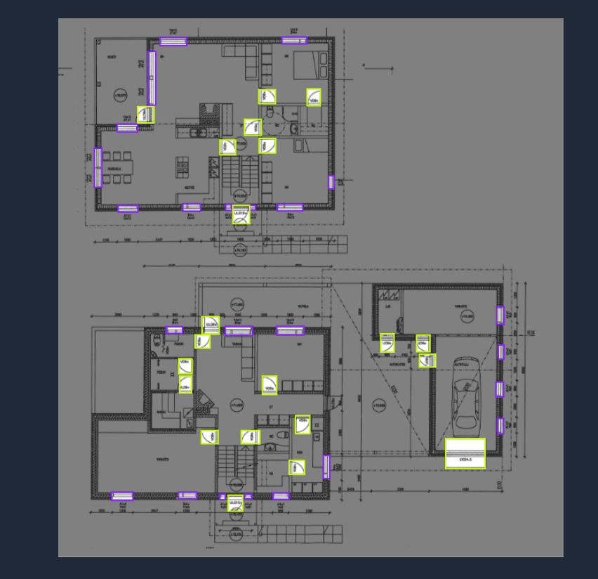

# 🏗️ Blueprint Detection Project

A YOLOv8-powered FastAPI application for detecting **doors and windows** in architectural blueprint images. This version introduces a fully **interactive drag-and-drop interface**, detailed detection outputs, image visualization, and intelligent model management.

---

## ✨ Features

- 🧠 YOLOv8 object detection (custom or fallback model)
- 🖼️ Interactive web interface at `/interactive`
- 📄 JSON API with bounding boxes and confidence scores
- 🎨 Optional image visualization with detections
- 📊 Inference time and system diagnostics
- ⚙️ Docker-ready deployment
- 🔒 CORS-enabled for frontend integration

---

## 🐳 Docker Setup

### 📦 Prerequisites

- Docker and Docker Compose installed
- Place a trained YOLOv8 model file in `models/` (e.g. `blueprint_detector.pt` or `best.pt`)  
  If not found, it falls back to `yolov8n.pt`.

### 🧱 Build and Run

```bash
docker-compose up --build
````

Then visit:

* 🔗 API root: [http://localhost:8000](http://localhost:8000)
* 🎮 Interactive UI: [http://localhost:8000/interactive](http://localhost:8000/interactive)
* 📚 API Docs: [http://localhost:8000/docs](http://localhost:8000/docs)
* 📘 Redoc: [http://localhost:8000/redoc](http://localhost:8000/redoc)

---

## 📤 Example API Request

Send an image to the `/detect` endpoint using `curl`. Replace `path/to/your/image.jpg` with the actual path to your image file.

```bash
curl -X POST -F "file=@path/to/your/image.jpg" \
"http://localhost:8000/detect?conf=0.25&iou=0.45&return_image=true"
```

✅ Returns JSON with detection info and optionally a base64 image with bounding boxes.

--- 

## 📊 Training and Labeling Evidence

### Model Training Screenshots

Here are some screenshots from the model training process, showcasing loss graphs and console output:

**Loss Graph (Final Result):**


**Console Output (Sample Epoch):**


### Data Labeling with LabelImg

We used LabelImg for annotating doors and windows in the blueprint images. 

**LabelImg Interface in Action:**


*Example of annotating objects in LabelImg.*


*Another view of the labeling process.*

### Sample Label Files (`.txt`)

The annotations are saved in YOLO `.txt` format. Each line represents one bounding box: `class_id center_x center_y width height` (all values are normalized).

**Example 1: `datasets/labels/train/10_png.rf.68ff4de97cc623b3ac5c49b5cbd22fc1.txt`**
```txt
0 0.7734375 0.25390625 0.0765625 0.0703125
0 0.59765625 0.17421875 0.05 0.040625
0 0.378125 0.8609375 0.065625 0.06875
0 0.8328125 0.63046875 0.0625 0.0515625
1 0.8046875 0.57265625 0.0421875 0.0515625
1 0.80078125 0.93671875 0.05 0.03125
1 0.54140625 0.87890625 0.0703125 0.034375
1 0.29921875 0.3609375 0.0703125 0.0453125
1 0.12421875 0.321875 0.0578125 0.046875
```

**Example 2: `datasets/labels/train/12_png.rf.45c0e4516b0ec6f04bac3e785d96371c.txt`**
```txt
0 0.74609375 0.8859375 0.0390625 0.0375
0 0.415625 0.84296875 0.0328125 0.0359375
0 0.5046875 0.86484375 0.0375 0.0328125
0 0.525 0.77578125 0.0375 0.0328125
0 0.54609375 0.81640625 0.0390625 0.0359375
0 0.60234375 0.790625 0.0359375 0.034375
1 0.66171875 0.996875 0.0546875 0.00625
1 0.42890625 0.95390625 0.05 0.0234375
1 0.50703125 0.65390625 0.0515625 0.0234375
1 0.4171875 0.68125 0.015625 0.0265625
# ... (additional lines truncated for brevity in README)
```

### 🎯 Detected Classes

This model is trained to detect the following classes:

- **`0`: door**
- **`1`: window**

These correspond to the `class_id` in the `.txt` label files and the `label` field in the API's JSON response.

---

## 🛑 Stop the Container

```bash
docker-compose down
```

---

## 🧪 Available Endpoints

| Method | Endpoint       | Description                             |
| ------ | -------------- | --------------------------------------- |
| GET    | `/`            | Root API info                           |
| GET    | `/interactive` | Interactive drag-and-drop frontend      |
| POST   | `/detect`      | Submit an image for detection           |
| POST   | `/visualize`   | Get annotated image                     |
| GET    | `/health`      | Check model status and environment info |

---

## 🧑‍💻 Local Development (No Docker)

1. Install dependencies:

   ```bash
   pip install -r requirements.txt
   ```

2. Run with Uvicorn:

   ```bash
   uvicorn new_version:app --host 0.0.0.0 --port 8000 --reload
   ```

Access the app at:

* `http://localhost:8000/interactive`

> To make it available at `http://localhost/interactive`, run on port 80:

```bash
sudo uvicorn new_version:app --host 0.0.0.0 --port 80
```

---

## 🗂 Project Structure

```
📦project-root
├── new_version.py           # Main FastAPI app
├── static/                  # HTML, CSS, JS for frontend UI
├── models/                  # YOLOv8 model files
├── Dockerfile               # Docker build definition
├── docker-compose.yml       # Docker Compose setup
├── requirements.txt         # Python dependencies
└── README.md                # This file
```

---

## 🔍 Model Loading Strategy

1. Searches for custom weights:

   * `models/blueprint_detector.pt`
   * `runs/detect/train/weights/blueprint_detector.pt`
   * `blueprint_detector.pt`
2. Falls back to pretrained `yolov8n.pt` if custom model not found
3. Model runs on CPU and loads during startup

---

## 📊 Example Detection Response

```json
{
  "success": true,
  "detections": [
    {
      "label": "door",
      "confidence": 0.87,
      "bbox": [125.4, 210.8, 56.2, 118.7],
      "bbox_normalized": [0.12, 0.22, 0.05, 0.13]
    },
    ...
  ],
  "visualization": "data:image/png;base64,...",
  "metrics": {
    "response_time_seconds": 0.342,
    "inference_time_seconds": 0.021,
    "detection_count": 4
  }
}
```

---

## 👤 Author

**Dhiwin Samrich**
📧 [dhiwinsamrichj@gmail.com](mailto:dhiwinsamrichj@gmail.com)

---

## 🪪 License

This project is licensed under the **MIT License**.

```

---

Let me know if you want to include:
- Badges (build, license, Python version)
- GitHub Actions CI/CD instructions
- DockerHub or Hugging Face deployment guides

I can generate those instantly.
```
